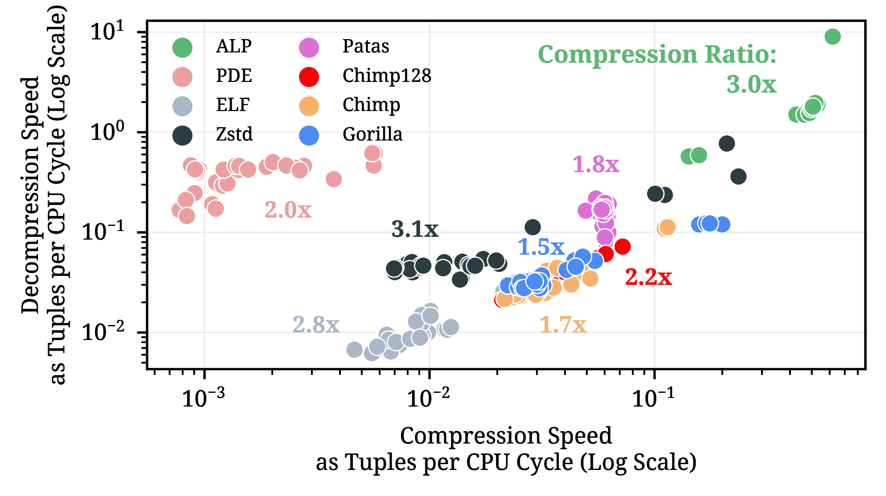

# ALP: Adaptive Lossless Floating-Point Compression

**Authors**: Azim Afroozeh, Leonardo Kuffó, Peter Boncz  
**Conference**: ACM SIGMOD 2024

---

## 📄 What is this repo?

This repository contains the source code and benchmarks for the paper [_ALP: Adaptive Lossless Floating-Point Compression_](https://dl.acm.org/doi/abs/10.1145/3626717), published at ACM SIGMOD 2024.

**ALP** is a state-of-the-art lossless compression algorithm designed for IEEE 754 floating-point data. It encodes data by exploiting two common patterns found in real-world floating-point values:

- **Decimal Floating-Point Numbers**:  
  A large portion of floats/doubles in real-world datasets are decimals. ALP maps these values into integers by multiplying the number by a power of 10 and then compressing the result using a FastLanes variant of Frame-of-Reference encoding[^1], which is SIMD-friendly.  
  _Example_: the number `10.12` becomes `1012` and is then fed to the FastLanes encoder.

- **High-Precision Floating-Point Numbers**:  
  The remaining values are typically high-precision floats/doubles. ALP targets compression opportunities in only the left part of these values, which it compresses using FastLanes dictionary encoding. The right part is left uncompressed, as it is required to preserve high precision and is often highly random and incompressible.

---

## 📊 How does ALP perform?



These results highlight ALP’s **superior** performance across all three key metrics of a compression algorithm:  
**Decoding Speed**, **Compression Ratio**, and **Compression Speed**—outperforming other schemes in every category.

---

## 🚀 How to Reproduce Results

Just run the following script:

```bash
./publication/script/master_script.sh
```

For more information on reproducing our benchmarks, refer to our guide [here](availability_reproducibility_initiative_report.md),  
or read the official ACM reproducibility report:  
[https://dl.acm.org/doi/10.1145/3687998.3717057](https://dl.acm.org/doi/10.1145/3687998.3717057)

🎉 We're proud to share that ALP won the **Best Artifact Award** from [SIGMOD](https://sigmod.org/sigmod-awards/sigmod-best-artifact-award/)!

---

## 📦 Want to Benchmark Your Dataset?

Check out our guide: [How to Benchmark Your Dataset](how_to_benchmark_your_dataset.md)  
It explains how to run ALP on your own data.

---

## 🧰 Repository Structure

- `src/`: Core implementation of ALP and ALP_RD
- `benchmarks/`: Benchmarking tools and datasets
- `include/`: Header files for integration
- `scripts/`: Utility scripts for data processing
- `test/`: Unit tests
- `publication/`: Publications and supplementary materials

---

## 📚 Publications

- **Conference Paper**:  
  _ALP: Adaptive Lossless Floating-Point Compression_, ACM SIGMOD 2024  
  [https://dl.acm.org/doi/10.1145/3626717](https://dl.acm.org/doi/10.1145/3626717)

- **Reproducibility Report**:  
  _Reproducibility Report for ACM SIGMOD 2024 Paper: 'ALP: Adaptive Lossless Floating-Point Compression'_  
  [https://dl.acm.org/doi/10.1145/3687998.3717057](https://dl.acm.org/doi/10.1145/3687998.3717057)

---

## 📄 License

This project is licensed under the MIT License. See the [LICENSE](LICENSE) file for details.

---

## 📬 Contact

If you have questions, want to contribute, or just want to stay up to date with ALP and related projects, join our community on Discord:  
[](https://discord.gg/2ngmRaRW)  [](https://discord.gg/2ngmRaRW)

---

## 🧩 Used By

ALP has been integrated into the following systems:

- [**DuckDB**](https://duckdb.org/2024/02/13/announcing-duckdb-0100.html)
- [**FastLanes**](https://github.com/cwida/FastLanes)
- [**KuzuDB**](https://github.com/kuzudb/kuzu/pull/3994)
- [**liquid-cache**](https://github.com/XiangpengHao/liquid-cache/pull/133)

---

[^1]: Learn more about FastLanes here: [https://github.com/cwida/fastlanes](https://github.com/cwida/fastlanes)
